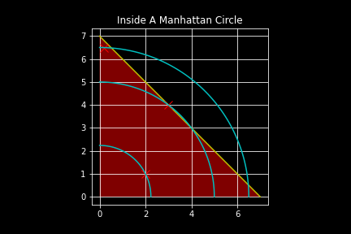

# Origin
There is this user **Clark Chen** who posted an interesting question on Python Taiwan, a Facebook group:

抱歉想請教更有效率的寫法。
假設我有10000個地點（10000個經緯度座標），我想要找出「每一個地點離他最近的地點」，並取出這個最短距離。
我目前只能想到用兩個套在一起的迴圈，裡面的迴圈用geopy算某一個地點自己和其他所有地點的距離，取出最小值，然後外面的迴圈重複10000次算所有的點。但試跑了一下覺得執行好久，而且總覺得資源吃超凶怕crash...
想請問有經驗的大大們不知道有沒有更有效率的做法？或是給我幾個關鍵字讓我自己去搜尋也可以。
先行謝過，感激不盡～

Unfaithful translation into English: 
Having `10_000` coordinates (i.e. longitude-latitude pairs) on Earth,
for each coordinate the user is looking for **another coordinate which is closest to it** and the **distance btw them**.
He used `geopy` to facilitate the calculation of the distance and was looking for something that could be more
efficient than a simple, naive double for loop thru the pairs of points on Earth.

## Proposed Solutions
Other people have suggested:
01. [`rtree`](https://gis.stackexchange.com/questions/22082/how-can-i-use-r-tree-to-find-points-within-a-distance-in-spatialite)
02. kdtree (e.g. from [`scipy.spatial`](https://docs.scipy.org/doc/scipy/reference/generated/scipy.spatial.KDTree.html))
03. [geoSearch (mongoDB)](https://docs.mongodb.com/manual/reference/command/geoSearch/)
04. [quad tree](http://homepage.divms.uiowa.edu/~kvaradar/sp2012/daa/ann.pdf)

## Misunderstanding
At first I misunderstood that the distance concerned was Euclidean distance (instead of geodesic on an ellipsoid/sphere). But this misunderstood question has its own merit:
> Prove or disprove that on 2D, manhanttan distance **gives the same order** of distance pairs as Euclidean distance does. That is, given $`x, y, z \in \mathbb{R}^{2}`$, we have $`d_{2}(x,z) > d_{2}(x,y) \iff d_{1}(x,z) > d_{1}(x,y)`$, where $`d_{1}, d_{2}`$ denotes the Manhattan and Euclidean distances, respectively. A stronger statement to prove would be $`\lVert v\rVert_{2} > \lVert w\rVert_{2} \iff \lVert v\rVert_{1} > \lVert w\rVert_{1}\quad\forall\; v, w \in \mathbb{R}^{2}.`$ Moreover, if this is provable, extend the proof to $`\mathbb{R}^{n}`$ and **any pair of norms**.

**Proof.** 
We shall use (without proof) a basic and well-known theorem about **finite-dimensional normed vector spaces**. That is, in such a space, all norms are **_equivalent_**. (Recall that two norms $`\lVert\cdot\rVert_{1}, \lVert\cdot\rVert_{2}`$ on a vector space $`V`$ are said to be **_equivalent_** if $`\exists\; a, b > 0\;`$ s.t. $`\;a\lVert u\rVert_{1} \le \lVert u\rVert_{2} \le b\lVert u\rVert_{1}\quad \forall\; u \in V.\,`$)

We show that if $`\lVert\cdot\rVert_{1}, \lVert\cdot\rVert_{2}`$ are two equivalent norms on a vector space $`V`$, then we have 
$`\lVert v\rVert_{2} \ge \lVert w\rVert_{2} \implies \lVert v\rVert_{1} > \lVert w\rVert_{1}\quad\forall\; v, w \in V.`$ The remaining direction $`(\impliedby)`$ is **immediate** after showing this.

Let $`v, w \in V.`$ 
Since $`\lVert\cdot\rVert_{1}, \lVert\cdot\rVert_{2}`$ are equivalent, there exist $`a, b > 0`$ s.t. $`\;a\lVert u\rVert_{1} \le \lVert u\rVert_{2} \le b\lVert u\rVert_{1}\quad \forall\; u \in V.\,`$ 
Now, Starting from $`\lVert v\rVert_{1}`$, we would like to reach the conclusion $`\lVert v\rVert_{1} \ge \lVert w\rVert_{1}.`$ 
This is quite ~~straightforward~~: ~~$`\lVert v\rVert_{1} \ge \frac{1}{b} \lVert v\rVert_{2} \ge \frac{1}{a} \lVert v\rVert_{2} \ge \frac{1}{a} \lVert w\rVert_{2} \ge \lVert w\rVert_{1}.`$~~ 

~~**Rmk.** The reason why I want to prove this is that, had **Clark Chen** asked the same question in $`\mathbb{R}^{2}`$ (instead of in $`S^{2}`$), calculating Manhattan distance is **clearly faster and easier** than calculating Euclidean distance.~~  
~~For example, facing with `10_000` points $`x_{0}, \ldots, x_{9999}`$ in $`\mathbb{R}^{2}`$, the order of the distances $`d(x_{0}, x_{1}), d(x_{0}, x_{2}), d(x_{0}, x_{3}), \ldots, d(x_{0}, x_{9999})`$ is **fixed** no matter which distance $`d`$ we choose to use.~~ 
~~I have written a small python script to verify this, cf. `misunderstanding/experiment.py`~~
 

The preceding inequality is **false**: We don't have $`\frac{1}{b} \lVert v\rVert_{2} \ge \frac{1}{a} \lVert v\rVert_{2} `$, because $`\frac{1}{b} \le \frac{1}{a}.`$ 
Looking from the other side, one might find it easy to find some counterexamples to disprove this: 
For example, $`u = \begin{pmatrix} 3 \\ 4\end{pmatrix}, v = \begin{pmatrix} 1 \\ 5\end{pmatrix} \implies \lVert u\rVert_{1} = 7 > 6 = \lVert v\rVert_{1} \quad\text{but}\quad \lVert u\rVert_{2} = 5 < \sqrt{26} = \lVert v\rVert_{2}.`$ 
In general, **the order in one norm does not guarantee any particular order in another**.

We could gain some intuition if we draw the "_circles_" in Manhattan norm and Euclidean norm in 2D space:
 
 

If we overlap them and look only at the first quadrant,
 
 

we see that
- Let `u` be a point in the **green** region.
  - `u`'s Euclidean norm is less than that of the point `(0, 1)`
  - However, `u`'s Manhattan norm is greater than that of `(0, 1)`
- Let `u` be a point in the **yellow** region, i.e. on the yellow line segment, other than the two points `(1, 0)`, `(0, 1)`
  - `u`'s Euclidean norm is less than that of the point `(0, 1)`
  - `u`'s Manhattan norm is equal to that of the point `(0, 1)`
- Let `u` be a point in the **red** region
  - `u`'s Euclidean norm is less than that of the point `(0, 1)`
  - `u`'s Manhattan norm is equal to that of the point `(0, 1)`

_Similarly_, from the figure below, we see that smaller Manhattan norm does not always imply smaller Euclidean norm.
 
 

